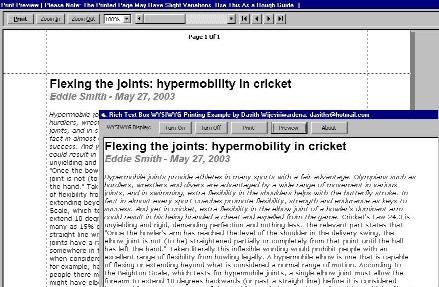



## A \[WYSIWYG\] Print and Print Preview for RTF

### Description

By Dasith,

This example shows you how to WYSIWYG Print and Print Preview using EM_FORMATRANGE and EM_SETTARGETDEVICE. The Print Preview can easily be used in your own project and it is fully customizable.

The problem with RTF.SelPrint is that you have no control over the print process (margins and etc.)

This shows you how to use you own Print function.

The Print Preview feature is not 100% accurate though. Still working on it.

If any of you guys develop this further please let me know.
 
### More Info
 

             |
---                |---
**Submitted On**   |2004-02-18 15:37:36
**By**             |[Dasith Wijesiriwardena](https://github.com/Planet-Source-Code/PSCIndex/blob/master/ByAuthor/dasith-wijesiriwardena.md)
**Level**          |Advanced
**User Rating**    |4.8 (101 globes from 21 users)
**Compatibility**  |VB 5\.0, VB 6\.0
**Category**       |[Complete Applications](https://github.com/Planet-Source-Code/PSCIndex/blob/master/ByCategory/complete-applications__1-27.md)
**World**          |[Visual Basic](https://github.com/Planet-Source-Code/PSCIndex/blob/master/ByWorld/visual-basic.md)
**Archive File**   |[WYSIWYG\_Pr1710332182004\.zip](https://github.com/Planet-Source-Code/dasith-wijesiriwardena-a-wysiwyg-print-and-print-preview-for-rtf__1-51819/archive/master.zip)

